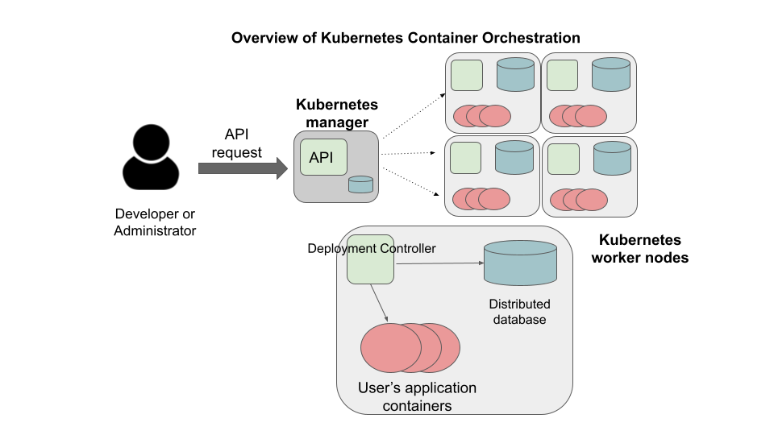

Introduction to Kubernetes
==========================

In this section we give an overview of the Kubernetes (**k8s**) system and test to see whether the 
**kubectl** CLI is configured correctly to allow us to interact with the cluster

After going through this module, students should be able to:

* Issue basic commands using ``kubectl``
* Connect to the class Kubernetes cluster and 
* **Design Principles**. Kubernetes improves our software portability, particularly 
  for large distributed applications that need to run across multiple machines

Kubernetes Overview
-------------------

Kubernetes (k8s) is itself a distributed system of software components that run a cluster of one or more machines (physical
computers or virtual machines). Each machine in a k8s cluster is either a "manager" or a "worker" node.

Users communicate with k8s by making requests to its API. The following steps outline how Kubernetes works at a high level:

1) Requests to k8s API describe the user's *desired state* on the cluster; for example, the desire that 3 containers of
   a certain image are running.
2) The k8s API schedules new containers to run on one or more worker nodes.
3) After the containers are started, the Kubernetes deployment controller, installed on each worker node, monitors the
   containers on the node.
4) The k8s components, including the API and the deployment controllers, maintain both the *desired state* and the
   *actual state* in a distributed database. The components continuously coordinate together to make the actual state
   converge to the desired state.

.. note::

  It is important to note that most of the time, the k8s API as well as the worker nodes are running on separate machines
  from the machine we use to interact with k8s (i.e., make API requests to it). The machine we use to interact with k8s
  only needs to have the k8s client tools installed, and in fact, as the k8s API is available over HTTP, we don't strictly
  speaking require the tools -- we could use curl or some other http client -- but the tools make 
  interacting with the API much easier.

Connecting to the TACC Kubernetes Instance
------------------------------------------

In this class, we will use a Kubernetes cluster running at TACC that we have created for use in this class 
for deploying our applications. To simplify the process
of accessing the Kubernetes cluster, we have enabled connectivity to it from the ``student-login`` host.
Therefore, any time you want to work with k8s, simply SSH to ``student-login`` with your TACC username as you have throughout the 
semester and then issue your ``kubectl`` commands

.. code-block:: console 

   [local] $ ssh username@student-login.tacc.utexas.edu
   [student-login] $ ...do kubernetes work...

This machine has Kubernetes tools installed on it and has *access to the Kubernetes API*
for the cluster, but you should be aware that this server is *not part of the Kubernetes cluster* itself. 
Note that it will require careful organization and work to keep files in sync between the ``student-login`` host and
your Jetstream VM.  

First Commands with k8s
-----------------------

We will use the Kubernetes Command Line Interface (CLI) referred to as "kubectl" (pronounced "Kube control") to make
requests to the Kubernetes API. We could use any HTTP client, including a command-line client such as curl, but ``kubectl``
simplifies the process of formatting requests.

The ``kubectl`` software should already be installed and configured to use the Freetail K8s cluster. Let's verify that
is the case by running the following:

.. code-block:: console

   [student-login]$ kubectl version -o yaml

You should see output similar to the following:

.. code-block:: console

   clientVersion:
     buildDate: "2023-12-19T13:42:57Z"
     compiler: gc
     gitCommit: 506050d61cf291218dfbd41ac93913945c9aa0da
     gitTreeState: clean
     gitVersion: v1.28.5
     goVersion: go1.20.12
     major: "1"
     minor: "28"
     platform: linux/amd64
   kustomizeVersion: v5.0.4-0.20230601165947-6ce0bf390ce3
   serverVersion:
     buildDate: "2023-12-19T13:32:53Z"
     compiler: gc
     gitCommit: 506050d61cf291218dfbd41ac93913945c9aa0da
     gitTreeState: clean
     gitVersion: v1.28.5
     goVersion: go1.20.12
     major: "1"
     minor: "28"
     platform: linux/amd64

This command made an API request to the TACC k8s cluster and returned information about the version
of k8s running there (under ``serverVersion``) as well as the version of the ``kubectl`` that we are running (under
``clientVersion``).

.. note::

  The output of the ``kubectl`` command was yaml because we used the ``-o yaml`` flag. We could have asked for the output
  to be formatted in json with ``-o json``. The ``-o`` flag is widely available on ``kubectl`` commands.

Authentication and Namespaces in Kubernetes
-------------------------------------------

Before we can do any real work on the Kubernetes cluster, we need to understand the concept of a *namespace*.
In Kubernetes, a *namespace* is a logical partition of objects defined on the cluster, and different users 
can have different levels of access (including no access at all) to different namespaces. In this way, 
Kubernetes supports launching different applications -- even different
applications owned by different users or organizations -- on the same physical cluster 
in an isolated way from each other. Each different user or organization would be assigned a different
namespace where their k8s objects would live, and users wouldn't have access to any other namespace. 

That is how the class Kubernetes cluster has been set up. Each of you has been assigned your own namespace
in the Kubernetes cluster where you have administrative access. Inside that namespace, you can create
and manage the Kubernetes objects for your application. And while all of the Kubernetes objects for every 
student is running on the same cluster, you won't see or have access to the objects in different namespaces.

We haven't introduced `pods` yet -- we will shortly -- but let's try a simple experiment: issue 
the following command 

.. code-block:: console 

   [student-login]$ kubectl get pods

You will get a response like the following:

.. code-block:: console

   No resources found in USERNAME namespace

Your ``kubectl`` client is configured to make requests in your private namespace, so it is only looking
for pods running on the cluster within your namespace. There may be many other pods currently running
on the cluster, you just do not have access to see them.

Try the following experiment. Specify a different namespace directly on the 
command line using the ``--namespace`` argument. Provide a namespace (e.g. ``wallen``) that you would not expect
to have access to:

.. code-block:: console

   [student-login]$ kubectl get pods --namespace=wallen

The response might look like:

.. code-block:: console

   Error from server (Forbidden): pods is forbidden: User "system:serviceaccount:USERNAME:USERNAME"
   cannot list resource "pods" in API group "" in the namespace "wallen"

This is the output we expect because we would not have access to that user's pods. 

To see more information about how k8s and the kubectl CLI is configured in your environment,
inspect the file located at ``~/.kube/config``.

To install the k8s CLI on your Jetstream instance, log in to Jetstream and issue the following 
commands (replacing USERNAME with your username):

.. code-block:: console

   [user-vm]$ sudo curl -LO "https://dl.k8s.io/release/v1.28.5/bin/linux/amd64/kubectl"
   [user-vm]$ sudo install -o root -g root -m 0755 kubectl /usr/local/bin/kubectl
   [user-vm]$ scp -r USERNAME@student-login.tacc.utexas.edu:~/.kube ./

To confirm whether it worked, try the following commands:

.. code-block:: console

   [user-vm]$ kubectl version --client
   Client Version: v1.28.5
   Kustomize Version: v5.0.4-0.20230601165947-6ce0bf390ce3
   [user-vm]$ kubectl get pods
   No resources found in USERNAME namespace.

Additional Resources
~~~~~~~~~~~~~~~~~~~~

 * `Kubernetes Reference <https://kubernetes.io/docs/home/>`_
